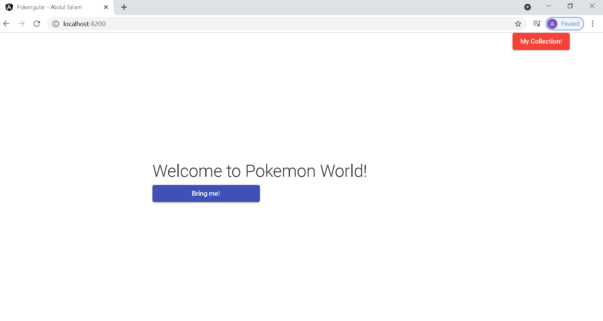

# Pokengular



This project was generated with [Angular CLI](https://github.com/angular/angular-cli) version 8.3.29.

## Pre Init
- Just type ```npm Install```
- Make sure the server is ON (the golang API, can found here [Here](https://github.com/abdulsalam01/gokemon-api))
- Check ```src/environtments``` to know the api is running on what port (:1323)

## Development server

Run `npx ng serve` for a dev server. Navigate to `http://localhost:4200/`. The app will automatically reload if you change any of the source files.

## Build

Run `npx ng build` to build the project. The build artifacts will be stored in the `dist/` directory. Use the `--prod` flag for a production build.

## Route
1. `http://localhost:4200/` is BASE
2. `http://localhost:4200/pokemon/list` is LIST OF POKEMON from https://pokeapi.co/
3. `http://localhost:4200/pokemon/list/detail/:id` is DETAIL OF POKEMON from https://pokeapi.co/
4. `http://localhost:4200/pokemy/collection` is LIST OF YOUR POKEMON (CATCHED!)
